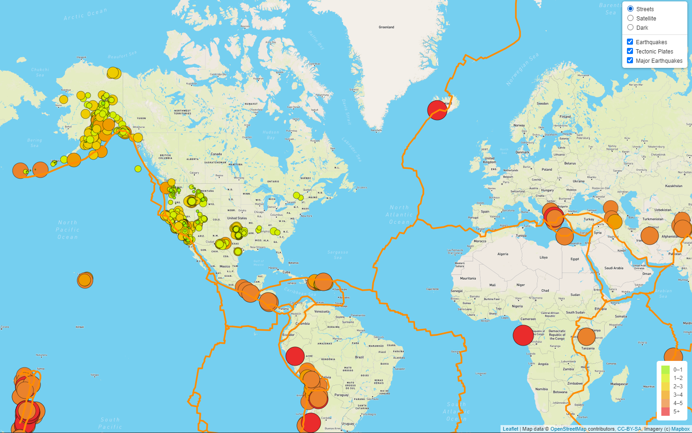
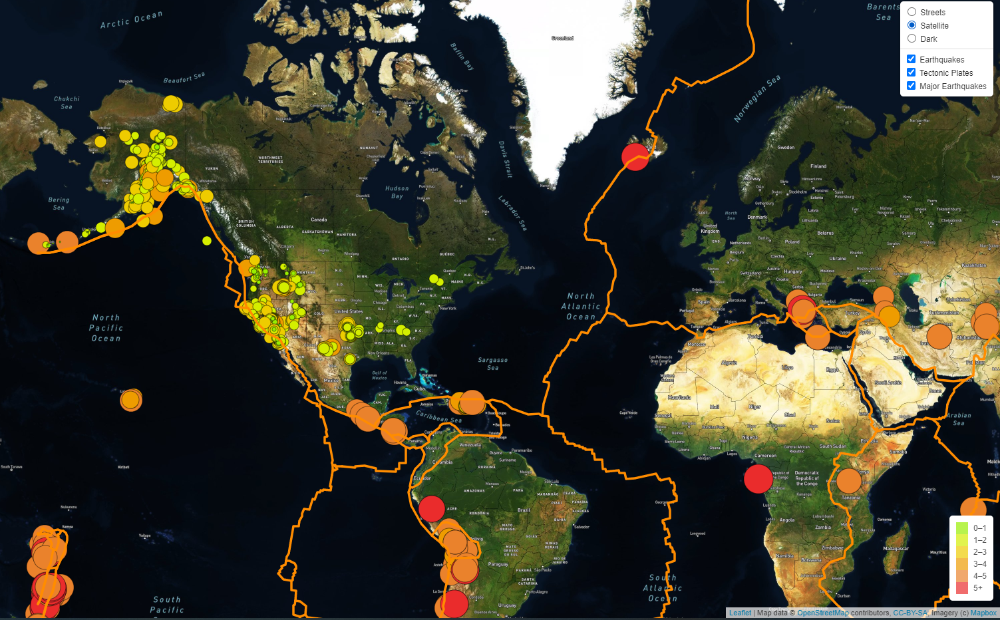
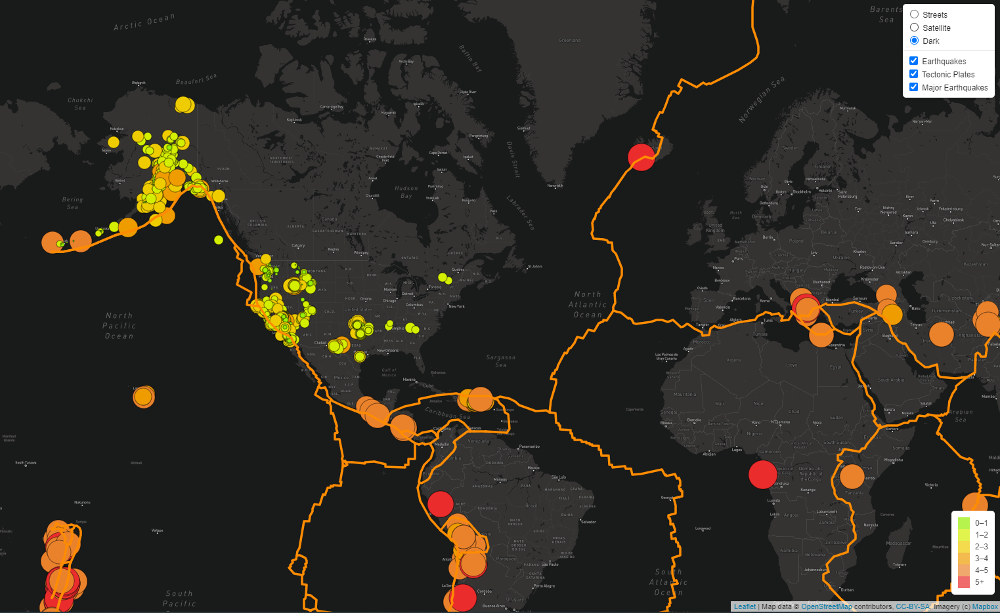
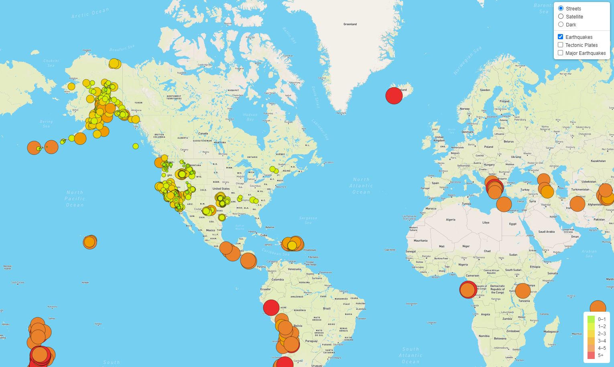
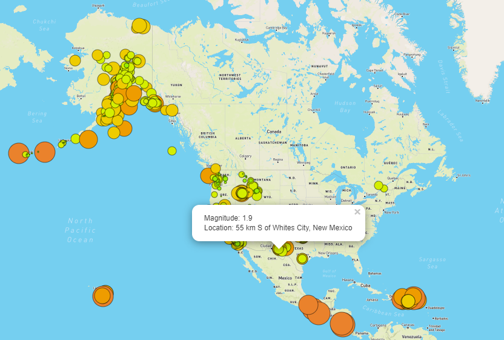
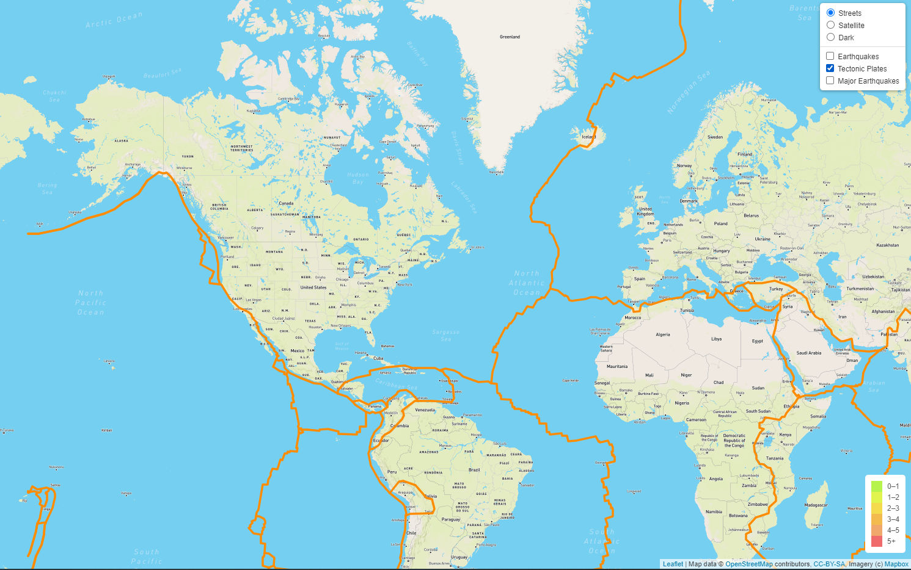
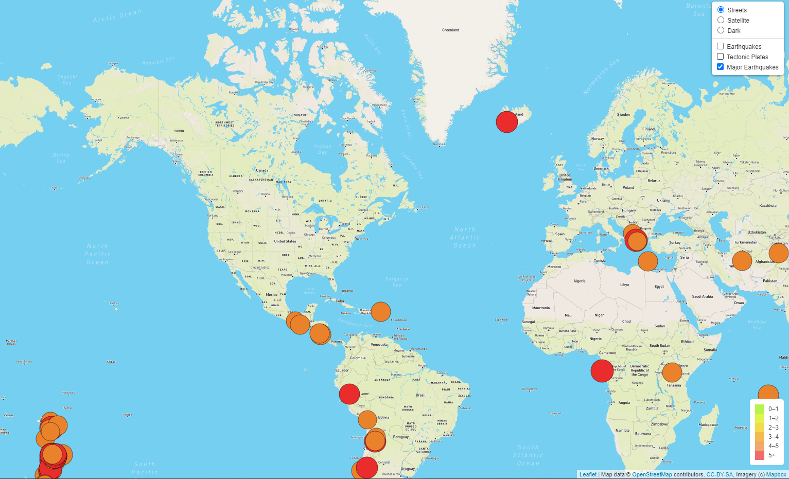

# Mapping_Earthquakes

The purpose of this weeks challenge was to create maps using our knowledge of JavaScript, Leaflet.js, and geoJSON data.

In the challenge, we are able to view the map from 3 different map views:  
<b>Streets:</b> 

<b>Satellite:</b> 

<b>Dark Map:</b> 

Using these different mapping views, the user can toggle between various data to display. 

<b>Earthquakes:</b> 
<i>Based on the legend, each circle marker reflects the location of all earthquakes and their magnitudes. Magnitudes appear
as a popup when the cursor is hovered over the marker. This earthquake data is was retrieved from earthquake.usgs.gov</i> 

<b>Tectonic Plates:</b> 
<i>This view reflects where tectonic plates exist on a world map. The purpose of this selection is to see
the earthquake data in relation to the tectonic plates’ location on the earth.</i> 

<b>Major Earthquakes:</b> 
<i>This view is an extension of our "Earthquakes" view. However, it is meant to only reflect locations with major earthquakes.
This selection reflects all the earthquakes with a magnitude magnitude less than 4, a magnitude greater than 4, and a magnitude greater than 5.
Like the "Earthquakes" view, popups allow additional data regarding location and magnitude.
</i> 

As such, you can view the selections individually or a combination of the three. 
Please note, due to API restrictions, there maybe some challenges in viewing the actual webpage.
